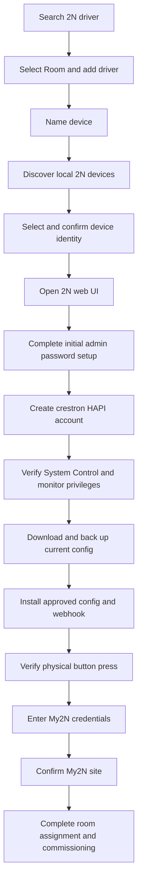

# Commissioning Flow: CLI and Setup-App Relationship

## Purpose

The CLI prototypes the local 2N commissioning segment that is not present in `../setup-app-mock/screen-01-add-device-drivers.html`. It validates device discovery, local credential bootstrap, configuration access, Automation webhook installation, interruption recovery, and a physical call-button event before those behaviors are added to the visual prototype.

The local 2N administrator/HAPI credentials and My2N cloud credentials are separate domains. They must be separate UI steps and state objects.

## Combined happy path



In the current HTML, `C` goes directly to `M`. The proposed local-device segment is `D` through `L`, inserted between `renderStepName()` and `renderStepCreds()`.

## Step mapping

| Phase | Owner | Input | Output/checkpoint | Retry path | Current or proposed HTML surface |
| --- | --- | --- | --- | --- | --- |
| Driver navigation | Setup app | Installer searches/selects 2N | Selected driver | Return through `navStack` | Current `[data-goto]`, `renderLeft()` |
| Add driver | Setup app | Plus button and selected Room | Modal starts | Close and select again | Current `[data-add]`, `openModal(driver)` |
| Name device | Installer | Friendly device name | `deviceName` | Stay on name validation | Current `renderStepName()` |
| Discover LAN device | Local driver/CLI | Processor or Mac subnet | IP, model, serial, MAC, firmware | Rescan or manual IP | Proposed `renderStepDiscovery()`; CLI `discover`/`info` |
| Confirm identity | Installer | Discovered device details | `device-identified` | Return to discovery | Proposed local-device details step |
| Initial administrator setup | Installer in 2N UI | Factory credential and chosen password | `admin-configured` | Reopen 2N UI; factory reset only if all access is lost | Proposed guided external step; CLI `commission` opens browser |
| Create HAPI account | Installer in 2N UI | HAPI username/password and privileges | `hapi-ready` after API verification | Correct account or privileges and resume | Proposed HAPI credential step; not My2N credentials |
| Back up config | Local driver/CLI | HAPI account with System Control | Private XML backup and SHA-256 | Retry when reachable/licensed | Proposed progress step; CLI `commission` |
| Apply settings/webhook | Local driver/CLI | Live config plus approved changes | `config-applied-unverified` | Download and compare before retry | Proposed progress step; CLI `verify-button --apply` for test rule |
| Verify call button | Installer and local driver | Physical button press | `verified`, event payload and receive time | Retry listener/press/config independently | Proposed verification step; CLI `verify-button` |
| Capture My2N credentials | Installer/cloud | My2N Site or Company Admin credentials and IDs | Authenticated My2N site lookup | Correct cloud credentials | Current `renderStepCreds()`, `submitCreds()`, `fetchSiteInfo()` |
| Confirm My2N site | Installer | Returned site details | Confirmed site | Back to My2N credentials | Current `renderStepSite()` |
| Complete add | Setup app | Local and cloud checks complete | Device assigned to Room | Resume failed phase | Current next step is not implemented; `renderStepSite()` closes modal |

## CLI state machine

```mermaid
stateDiagram-v2
    [*] --> DeviceIdentified
    DeviceIdentified --> AdminConfigured: Installer completes 2N web UI
    AdminConfigured --> HapiReady: GET /api/config succeeds
    HapiReady --> WebhookPending: Backup and candidate rule saved
    WebhookPending --> ConfigAppliedUnverified: PUT accepted and live rule matches
    ConfigAppliedUnverified --> Verified: Authenticated button event received
    Verified --> Restored: Prior Automation group restored

    AdminConfigured --> AdminConfigured: Fix HAPI account and resume
    HapiReady --> HapiReady: Device/license unavailable; retry later
    WebhookPending --> WebhookPending: Dry run or upload outcome unknown
    ConfigAppliedUnverified --> ConfigAppliedUnverified: Listener/event timeout
```



The checkpoint contains no passwords or webhook tokens. It records device IP and identity, phase, backup path/hash, target Automation group, desired-config hash, and verification status. Secrets are prompted again after restart.

## Failure and recovery mapping

| Failure point | Persisted state | Installer sees | Recovery | Factory reset? |
| --- | --- | --- | --- | --- |
| Discovery finds nothing | None | Likely power/network/VLAN causes | Rescan or enter IP | No |
| Admin setup completed, HAPI missing | `admin-configured` | HAPI authentication failed | Reopen web UI, create/correct HAPI account, resume | No |
| HAPI account lacks System Control | `admin-configured` | Required privilege missing | Grant System Control, resume | No |
| Config license missing | `hapi-ready` | Config upload unavailable/rejected | Install Enhanced Integration/Automation license, resume | No |
| Device drops during upload | `webhook-pending` | Upload outcome unknown | Download live config and compare before retry | No |
| Uploaded config absent | `webhook-pending` | Verification failed | Retry reviewed upload | No |
| Webhook listener unreachable | `config-applied-unverified` | No event before timeout | Correct advertised LAN IP/firewall and listen again | No |
| Wrong/malformed event | `config-applied-unverified` | Receiver rejection reason | Correct Automation payload/auth and retry | No |
| Temporary test not cleaned up | Saved prior group | Cleanup pending | Run `restore-webhook` | No |
| All administrator access lost | Last checkpoint | Cannot enter 2N UI or repair HAPI | Follow vendor password recovery/reset procedure | Possibly, last resort |

This matches the backlog requirement that an unreachable door station remains commissioned but not configured and offers retry. A partial setup must not roll back device addition or My2N work that already succeeded.

## Credential and authority boundaries

| Credential | Used by | Purpose | Stored by this prototype |
| --- | --- | --- | --- |
| 2N web administrator | Installer and 2N web UI | Initial setup, recovery, HAPI account creation | No |
| `crestron` HAPI account | CLI/local driver | Monitor camera/call/I/O and read/write approved config | No; prompted per run |
| Temporary webhook token | 2N Automation and local receiver | Authenticate one verification run | No; generated in memory |
| My2N Site/Company Admin | Existing HTML/cloud flow | My2N site lookup and later cloud registration | Existing mock state only |

The proposed `modalState` should therefore gain a separate `localDevice` object rather than putting local credentials into the existing `creds` object. The current `creds` object belongs to My2N.

## Proposed HTML state progression

The current dispatcher handles `name`, `creds`, and `site`. A future integration can extend it without changing the My2N contract:

```text
name
  -> discover-local
  -> local-device-details
  -> local-admin-setup
  -> local-hapi-verify
  -> local-config-progress
  -> verify-button
  -> creds
  -> site
```

Suggested `modalState` responsibilities:

```text
modalState.driver          selected driver
modalState.deviceName      installer-friendly name
modalState.localDevice     IP/model/serial/MAC/firmware and checkpoint phase
modalState.localError      local discovery/config/webhook error
modalState.creds           My2N username/password/companyId/siteId
modalState.site            My2N site result
modalState.error           current My2N lookup error
```

Passwords should remain transient and outside persisted browser state. The future browser UI will need a localhost Python service because browser CORS, TLS, and LAN-discovery restrictions prevent direct 2N control.

## Current HTML gaps exposed by the CLI

1. The displayed device serial and IP values are static mock strings rather than discovery results.
2. `renderStepName()` advances directly to My2N credentials, skipping local selection and commissioning.
3. There is no distinction in the UI between the 2N administrator, 2N HAPI, and My2N credential domains.
4. There is no progress/checkpoint surface for a device that is added but not fully configured.
5. There is no Automation license check or `SystemControl` privilege explanation.
6. There is no physical event-verification step or webhook cleanup state.
7. `renderStepSite()` closes the modal because the post-site completion flow is not built.

## Prototype-to-product decision gates

- Confirm the supported administrator-password workflow and whether 2N publishes an automation API for it.
- Validate `/api/config` upload behavior, multipart shape, apply time, firmware support, and licensing on every target model.
- Confirm the exact production Automation event. The prototype follows the captured `CallStateChanged` outgoing/ringing sample as the call-button signal.
- Decide whether the long-lived driver account retains `SystemControl` for repair or a separate commissioning identity owns config updates.
- Replace the temporary HTTP/token receiver with the processor's production webhook transport and authentication model.
- Decide whether webhook verification is mandatory commissioning acceptance or an installer-invoked diagnostic.
